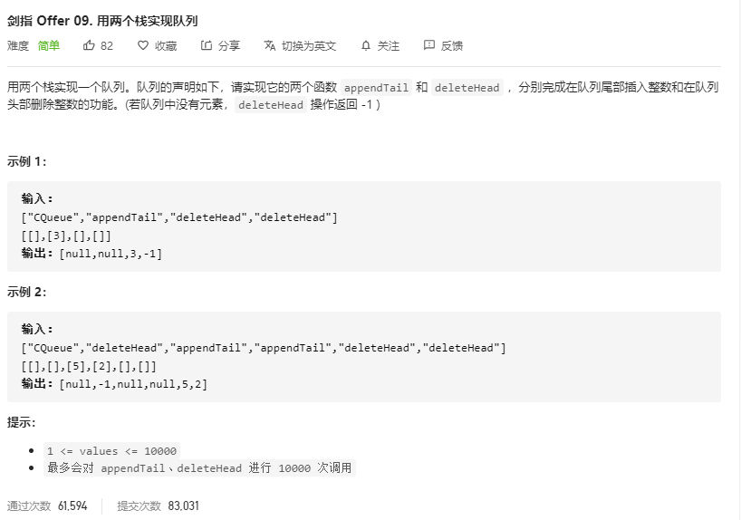

## 题目

[Leetcode-题目链接](https://leetcode-cn.com/problems/yong-liang-ge-zhan-shi-xian-dui-lie-lcof/)   

[github-链接](https://github.com/WenJiang99/leetcode/tree/master/String/stacksForQueue)

   


## 解法

### 思路
用一个插入栈，一个删除栈来存储数据。插入的时候，把数据插入到插入栈中，在删除的时候，把插入栈的数据依次出栈，再压入删除栈中，然后把删除栈中的最顶元素出栈。

删除操作的时候，只在删除栈为空的时候才把插入栈的数据转移过去。

### 代码
```js 
var CQueue = function () {
  this.insertStack = []
  this.deleteStack = []
};

/** 
 * @param {number} value
 * @return {void}
 */
CQueue.prototype.appendTail = function (value) {
  this.insertStack.push(value)
};

/**
 * @return {number}
 */
CQueue.prototype.deleteHead = function () {
  if (this.deleteStack.length === 0) {
    while (this.insertStack.length > 0) {
      this.deleteStack.push(this.insertStack.pop())
    }
  }
  const value = this.deleteStack.pop()
  return value === undefined ? -1 : value;
};


```

### 效率
耗时：492ms,%
内存：47.9MB,%

## 参考
- []()

## 推荐阅读
- []()
