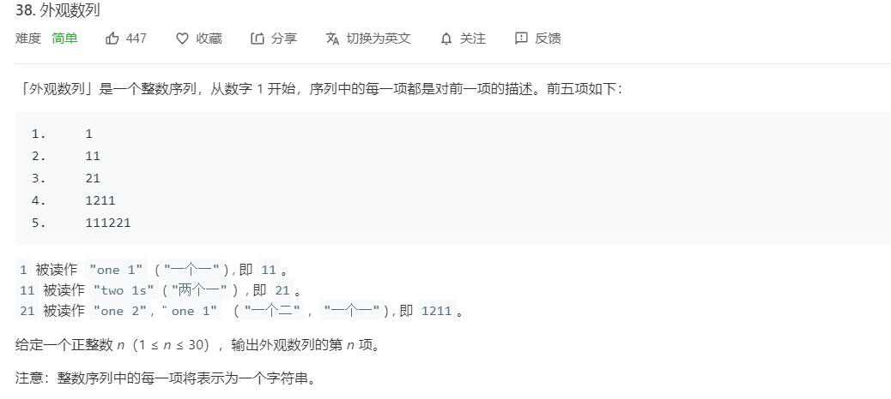

## 题目

[LeetCode-题目链接](https://leetcode-cn.com/problems/count-and-say/)
[Github-链接](https://github.com/WenJiang99/leetcode/tree/master/String/DescriptionArr)




## 解法1 正则表达式解法

### 思路

#### 题目解读

首先需要先理解一下题目中描述的 **外观数列** 到底是什么意思以及有什么规律
```
1.     1
2.     11
3.     21
4.     1211
5.     111221

1 被读作  "one 1"  ("一个一") , 即 11。
11 被读作 "two 1s" ("两个一"）, 即 21。
21 被读作 "one 2",  "one 1" （"一个二" ,  "一个一") , 即 1211。

```

从上面的描述我们可以知道这个 **外观数列** 的大概意思
- 数列的第n项中的结果是由其前一项的表达式所决定的，第n项中表达式中的数字序列应该是 **每两个**作为一组 `描述组合` $a_1 a_2$,表示其前一项中对应位置是 $a_1$个$a_2$
- 例如第五项$A_5$ 是 `111221`，两两分成一组为 11, 12, 21,其中 11表示第四项 $A_4$最前面是 1个1，即 '1',而 12 表示 $A_4$ 中在前面的 '1' 后面是 1个2,即 '12',后面 21则表示有2个1,因此得到 $A_4$应该是 ‘1211’
- 同样如果第五项$A_5$是`111221`的话，则可以得到第六项 $A_6$应该是 312211

从上面的理解我们也可以得到一些规律
- 数列中的每一项中数字的个数一定是 **2的倍数**,即 $2N$，因为**每一项都是对前一项的描述**，而每一组描述都需要两个字符来完成，所以最终的总字符一定是偶数个
- 如果第n项 $A_n$ 的数字序列是 $a_1a_2a_3...a_m$, 共m个数字，其中不重复的有k个（k是不重复的数字个数，如 111122中数字一共有6个，其中不重复数字是1,2一共2个），要表示前一项的 `k`个不重复数字,至少需要 $2k$个。

最重要的两个结论是
- 根据外观数列的定义可以知道，**每一项都是对前一项的描述**，那可以断定的是，如果数列第n项是 $A_n=a_1a_2a_3a_4a_5a_6...a_{n-1}a_n$，则可以知道前一项 $A_{n-1}$ 是由 $a_2a_4a_6...a_n$ 组成的，因此$a_2\neq a_4$, $a_4\neq a_6$,依次往下，否则就会被合并成同一个组合。例如 `111**3**21131221` 中偶数位置数字序列 分别是 1,3,1,3,2,1 相邻的两个一定不相等，否则如果是 `111**1**21131221`，则前面四个数 `1111`表示前一项对应的两个数字就是 `11`，而又由`描述组合`的规则来看，要表示这两个数，下一项应该要用 `21` 来表示，而不是 `1111`，所以就会矛盾，所以可知每一项的数字序列中，最多会连续出现相同的数字的数目是3个，不会有连续四个数字相同
- 有上面的规律可以进一步推论出一个更重要的结论：任何一项的数字序列中，**一定只由 ` 1,2,3 ` 三个字符中的若干个组成，而不会出现其他数字**，不会出现 4,5,6,...。

#### 实现思路

在得出上面两个重要结论之后，可以想到，既然数字序列中最多只可能出现 1,2,3 三个数字的组合，那便可以是一个正则表达式去匹配连续出现的 1, 2, 3 的序列，然后得出这段序列的长度，进而得出下一项的 `描述组合`，也就可以得到任一项的数字序列了。

题目要求的是输入一个 **项数n**,输入对应的 **第n项的数字序列**，这里的话可以从第一项开始往后一直递推到第n项。

好了，扯了这么多，终于要到怎么去用代码解决这个问题的时候了

### 代码实现

```js
/**
 * @param {number} n
 * @return {string}
 */
var countAndSay = function (n) {
    if (n === 1) return '1';
    let current = '1';
    let next = '';
    for (let i = 2; i <= n; i++) {
        current.replace(/(1+)|(2+)|(3+)/g, function (m) {
            next += (m.length + '' + m[0])
            return ''
        })
        current = next;
        next = '';
    }
    return current;

};
```

这里的主要部分就是在这个 `for`循环，循环主要是用来控制递推的阶数，循环体内的 正则表达式部分便是用来 从上一项递推到出下一项的结果

```js
current.replace(/(1+)|(2+)|(3+)/g, function (m) {
    next += (m.length + '' + m[0])
    return ''
})
```

这里的正则表达式 `/(1+)|(2+)|(3+)/g`，用来检测连续出现的 1,2,3

### 效率

耗时： 76ms 38.4%
内存： 36.5MB 50%

## 神奇的解法

正当我苦苦思索一种不需要递推而直接得到项数n与其数字序列$A_n$之间的关系的方法，但却百思不得其解的时候，我看到了题解上的一种神奇的方法让我心生敬佩......

[链接](https://leetcode-cn.com/problems/count-and-say/solution/da-biao-ju-ran-4ms-by-ninjayahoo/)

**果然啊，还是有人做了我一直想做却不敢做的事情**

```java
class Solution {
public:
    string countAndSay(int n) {
        string arr[31] = 
        {
            "","1",
"11",
"21",
"1211",
"111221",
"312211",
"13112221",
"1113213211",
"31131211131221",
"13211311123113112211",
"11131221133112132113212221",
"3113112221232112111312211312113211",
"1321132132111213122112311311222113111221131221",
"11131221131211131231121113112221121321132132211331222113112211",
"311311222113111231131112132112311321322112111312211312111322212311322113212221",
"132113213221133112132113311211131221121321131211132221123113112221131112311332111213211322211312113211",
"11131221131211132221232112111312212321123113112221121113122113111231133221121321132132211331121321231231121113122113322113111221131221",
"31131122211311123113321112131221123113112211121312211213211321322112311311222113311213212322211211131221131211132221232112111312111213111213211231131122212322211331222113112211",
"1321132132211331121321231231121113112221121321132122311211131122211211131221131211132221121321132132212321121113121112133221123113112221131112311332111213122112311311123112111331121113122112132113213211121332212311322113212221",
"11131221131211132221232112111312111213111213211231132132211211131221131211221321123113213221123113112221131112311332211211131221131211132211121312211231131112311211232221121321132132211331121321231231121113112221121321133112132112312321123113112221121113122113121113123112112322111213211322211312113211",
"311311222113111231133211121312211231131112311211133112111312211213211312111322211231131122211311122122111312211213211312111322211213211321322113311213212322211231131122211311123113223112111311222112132113311213211221121332211211131221131211132221232112111312111213111213211231132132211211131221232112111312211213111213122112132113213221123113112221131112311311121321122112132231121113122113322113111221131221",
"132113213221133112132123123112111311222112132113311213211231232112311311222112111312211311123113322112132113213221133122112231131122211211131221131112311332211211131221131211132221232112111312111213322112132113213221133112132113221321123113213221121113122123211211131221222112112322211231131122211311123113321112131221123113111231121113311211131221121321131211132221123113112211121312211231131122211211133112111311222112111312211312111322211213211321322113311213211331121113122122211211132213211231131122212322211331222113112211",
"111312211312111322212321121113121112131112132112311321322112111312212321121113122112131112131221121321132132211231131122211331121321232221121113122113121113222123112221221321132132211231131122211331121321232221123113112221131112311332111213122112311311123112112322211211131221131211132221232112111312211322111312211213211312111322211231131122111213122112311311221132211221121332211213211321322113311213212312311211131122211213211331121321123123211231131122211211131221131112311332211213211321223112111311222112132113213221123123211231132132211231131122211311123113322112111312211312111322212321121113122123211231131122113221123113221113122112132113213211121332212311322113212221",
"3113112221131112311332111213122112311311123112111331121113122112132113121113222112311311221112131221123113112221121113311211131122211211131221131211132221121321132132212321121113121112133221123113112221131112311332111213213211221113122113121113222112132113213221232112111312111213322112132113213221133112132123123112111311222112132113311213211221121332211231131122211311123113321112131221123113112221132231131122211211131221131112311332211213211321223112111311222112132113212221132221222112112322211211131221131211132221232112111312111213111213211231132132211211131221232112111312211213111213122112132113213221123113112221133112132123222112111312211312112213211231132132211211131221131211132221121311121312211213211312111322211213211321322113311213212322211231131122211311123113321112131221123113112211121312211213211321222113222112132113223113112221121113122113121113123112112322111213211322211312113211",
"132113213221133112132123123112111311222112132113311213211231232112311311222112111312211311123113322112132113212231121113112221121321132132211231232112311321322112311311222113111231133221121113122113121113221112131221123113111231121123222112132113213221133112132123123112111312111312212231131122211311123113322112111312211312111322111213122112311311123112112322211211131221131211132221232112111312111213111213211231132132211211131221232112111312212221121123222112132113213221133112132123123112111311222112132113213221132213211321322112311311222113311213212322211211131221131211221321123113213221121113122113121132211332113221122112133221123113112221131112311332111213122112311311123112111331121113122112132113121113222112311311221112131221123113112221121113311211131122211211131221131211132221121321132132212321121113121112133221123113112221131112212211131221121321131211132221123113112221131112311332211211133112111311222112111312211311123113322112111312211312111322212321121113121112133221121321132132211331121321231231121113112221121321132122311211131122211211131221131211322113322112111312211322132113213221123113112221131112311311121321122112132231121113122113322113111221131221",
"1113122113121113222123211211131211121311121321123113213221121113122123211211131221121311121312211213211321322112311311222113311213212322211211131221131211221321123113213221121113122113121113222112131112131221121321131211132221121321132132211331121321232221123113112221131112311322311211131122211213211331121321122112133221121113122113121113222123211211131211121311121321123113111231131122112213211321322113311213212322211231131122211311123113223112111311222112132113311213211221121332211231131122211311123113321112131221123113111231121113311211131221121321131211132221123113112211121312211231131122113221122112133221121113122113121113222123211211131211121311121321123113213221121113122113121113222113221113122113121113222112132113213221232112111312111213322112311311222113111221221113122112132113121113222112311311222113111221132221231221132221222112112322211213211321322113311213212312311211131122211213211331121321123123211231131122211211131221131112311332211213211321223112111311222112132113213221123123211231132132211231131122211311123113322112111312211312111322111213122112311311123112112322211213211321322113312211223113112221121113122113111231133221121321132132211331121321232221123123211231132132211231131122211331121321232221123113112221131112311332111213122112311311123112112322211211131221131211132221232112111312111213111213211231132132211211131221131211221321123113213221123113112221131112211322212322211231131122211322111312211312111322211213211321322113311213211331121113122122211211132213211231131122212322211331222113112211",
"31131122211311123113321112131221123113111231121113311211131221121321131211132221123113112211121312211231131122211211133112111311222112111312211312111322211213211321322123211211131211121332211231131122211311122122111312211213211312111322211231131122211311123113322112111331121113112221121113122113111231133221121113122113121113222123211211131211121332211213211321322113311213211322132112311321322112111312212321121113122122211211232221123113112221131112311332111213122112311311123112111331121113122112132113311213211321222122111312211312111322212321121113121112133221121321132132211331121321132213211231132132211211131221232112111312212221121123222112132113213221133112132123123112111311222112132113311213211231232112311311222112111312211311123113322112132113212231121113112221121321132122211322212221121123222112311311222113111231133211121312211231131112311211133112111312211213211312111322211231131122211311123113322113223113112221131112311332211211131221131211132211121312211231131112311211232221121321132132211331221122311311222112111312211311123113322112132113213221133122211332111213112221133211322112211213322112111312211312111322212321121113121112131112132112311321322112111312212321121113122112131112131221121321132132211231131122211331121321232221121113122113121122132112311321322112111312211312111322211213111213122112132113121113222112132113213221133112132123222112311311222113111231132231121113112221121321133112132112211213322112111312211312111322212311222122132113213221123113112221133112132123222112111312211312111322212321121113121112133221121311121312211213211312111322211213211321322123211211131211121332211213211321322113311213212312311211131122211213211331121321122112133221123113112221131112311332111213122112311311123112111331121113122112132113121113222112311311222113111221221113122112132113121113222112132113213221133122211332111213322112132113213221132231131122211311123113322112111312211312111322212321121113122123211231131122113221123113221113122112132113213211121332212311322113212221",
"13211321322113311213212312311211131122211213211331121321123123211231131122211211131221131112311332211213211321223112111311222112132113213221123123211231132132211231131122211311123113322112111312211312111322111213122112311311123112112322211213211321322113312211223113112221121113122113111231133221121321132132211331121321232221123123211231132132211231131122211331121321232221123113112221131112311332111213122112311311123112112322211211131221131211132221232112111312211322111312211213211312111322211231131122111213122112311311221132211221121332211213211321322113311213212312311211131122211213211331121321123123211231131122211211131221232112111312211312113211223113112221131112311332111213122112311311123112112322211211131221131211132221232112111312211322111312211213211312111322211231131122111213122112311311221132211221121332211211131221131211132221232112111312111213111213211231132132211211131221232112111312211213111213122112132113213221123113112221133112132123222112111312211312112213211231132132211211131221131211322113321132211221121332211213211321322113311213212312311211131122211213211331121321123123211231131122211211131221131112311332211213211321322113311213212322211322132113213221133112132123222112311311222113111231132231121113112221121321133112132112211213322112111312211312111322212311222122132113213221123113112221133112132123222112111312211312111322212311322123123112111321322123122113222122211211232221123113112221131112311332111213122112311311123112111331121113122112132113121113222112311311221112131221123113112221121113311211131122211211131221131211132221121321132132212321121113121112133221123113112221131112212211131221121321131211132221123113112221131112311332211211133112111311222112111312211311123113322112111312211312111322212321121113121112133221121321132132211331121321132213211231132132211211131221232112111312212221121123222112311311222113111231133211121321321122111312211312111322211213211321322123211211131211121332211231131122211311123113321112131221123113111231121123222112111331121113112221121113122113111231133221121113122113121113221112131221123113111231121123222112111312211312111322212321121113121112131112132112311321322112111312212321121113122122211211232221121321132132211331121321231231121113112221121321133112132112312321123113112221121113122113111231133221121321132132211331221122311311222112111312211311123113322112111312211312111322212311322123123112112322211211131221131211132221132213211321322113311213212322211231131122211311123113321112131221123113112211121312211213211321222113222112132113223113112221121113122113121113123112112322111213211322211312113211",
"11131221131211132221232112111312111213111213211231132132211211131221232112111312211213111213122112132113213221123113112221133112132123222112111312211312112213211231132132211211131221131211132221121311121312211213211312111322211213211321322113311213212322211231131122211311123113223112111311222112132113311213211221121332211211131221131211132221231122212213211321322112311311222113311213212322211211131221131211132221232112111312111213322112131112131221121321131211132221121321132132212321121113121112133221121321132132211331121321231231121113112221121321133112132112211213322112311311222113111231133211121312211231131122211322311311222112111312211311123113322112132113212231121113112221121321132122211322212221121123222112111312211312111322212321121113121112131112132112311321322112111312212321121113122112131112131221121321132132211231131122111213122112311311222113111221131221221321132132211331121321231231121113112221121321133112132112211213322112311311222113111231133211121312211231131122211322311311222112111312211311123113322112132113212231121113112221121321132122211322212221121123222112311311222113111231133211121312211231131112311211133112111312211213211312111322211231131122111213122112311311222112111331121113112221121113122113121113222112132113213221232112111312111213322112311311222113111221221113122112132113121113222112311311222113111221132221231221132221222112112322211211131221131211132221232112111312111213111213211231132132211211131221232112111312211213111213122112132113213221123113112221133112132123222112111312211312111322212321121113121112133221132211131221131211132221232112111312111213322112132113213221133112132113221321123113213221121113122123211211131221222112112322211231131122211311123113321112132132112211131221131211132221121321132132212321121113121112133221123113112221131112311332111213211322111213111213211231131211132211121311222113321132211221121332211213211321322113311213212312311211131122211213211331121321123123211231131122211211131221131112311332211213211321223112111311222112132113213221123123211231132132211231131122211311123113322112111312211312111322111213122112311311123112112322211213211321322113312211223113112221121113122113111231133221121321132132211331121321232221123123211231132132211231131122211331121321232221123113112221131112311332111213122112311311123112112322211211131221131211132221232112111312211322111312211213211312111322211231131122111213122112311311221132211221121332211213211321322113311213212312311211131211131221223113112221131112311332211211131221131211132211121312211231131112311211232221121321132132211331121321231231121113112221121321133112132112211213322112312321123113213221123113112221133112132123222112311311222113111231132231121113112221121321133112132112211213322112311311222113111231133211121312211231131112311211133112111312211213211312111322211231131122111213122112311311221132211221121332211211131221131211132221232112111312111213111213211231132132211211131221232112111312211213111213122112132113213221123113112221133112132123222112111312211312111322212311222122132113213221123113112221133112132123222112311311222113111231133211121321132211121311121321122112133221123113112221131112311332211322111312211312111322212321121113121112133221121321132132211331121321231231121113112221121321132122311211131122211211131221131211322113322112111312211322132113213221123113112221131112311311121321122112132231121113122113322113111221131221",
"3113112221131112311332111213122112311311123112111331121113122112132113121113222112311311221112131221123113112221121113311211131122211211131221131211132221121321132132212321121113121112133221123113112221131112212211131221121321131211132221123113112221131112311332211211133112111311222112111312211311123113322112111312211312111322212321121113121112133221121321132132211331121321132213211231132132211211131221232112111312212221121123222112311311222113111231133211121321321122111312211312111322211213211321322123211211131211121332211231131122211311123113321112131221123113111231121123222112111331121113112221121113122113111231133221121113122113121113221112131221123113111231121123222112111312211312111322212321121113121112131112132112311321322112111312212321121113122122211211232221121321132132211331121321231231121113112221121321132132211322132113213221123113112221133112132123222112111312211312112213211231132132211211131221131211322113321132211221121332211231131122211311123113321112131221123113111231121113311211131221121321131211132221123113112211121312211231131122211211133112111311222112111312211312111322211213211321223112111311222112132113213221133122211311221122111312211312111322212321121113121112131112132112311321322112111312212321121113122122211211232221121321132132211331121321231231121113112221121321132132211322132113213221123113112221133112132123222112111312211312112213211231132132211211131221131211322113321132211221121332211213211321322113311213212312311211131122211213211331121321123123211231131122211211131221131112311332211213211321223112111311222112132113213221123123211231132132211231131122211311123113322112111312211312111322111213122112311311123112112322211213211321322113312211223113112221121113122113111231133221121321132132211331222113321112131122211332113221122112133221123113112221131112311332111213122112311311123112111331121113122112132113121113222112311311221112131221123113112221121113311211131122211211131221131211132221121321132132212321121113121112133221123113112221131112311332111213122112311311123112112322211322311311222113111231133211121312211231131112311211232221121113122113121113222123211211131221132211131221121321131211132221123113112211121312211231131122113221122112133221121321132132211331121321231231121113121113122122311311222113111231133221121113122113121113221112131221123113111231121123222112132113213221133112132123123112111312211322311211133112111312211213211311123113223112111321322123122113222122211211232221121113122113121113222123211211131211121311121321123113213221121113122123211211131221121311121312211213211321322112311311222113311213212322211211131221131211221321123113213221121113122113121113222112131112131221121321131211132221121321132132211331121321232221123113112221131112311322311211131122211213211331121321122112133221121113122113121113222123112221221321132132211231131122211331121321232221121113122113121113222123211211131211121332211213111213122112132113121113222112132113213221232112111312111213322112132113213221133112132123123112111311222112132113311213211221121332211231131122211311123113321112131221123113112221132231131122211211131221131112311332211213211321223112111311222112132113212221132221222112112322211211131221131211132221232112111312111213111213211231131112311311221122132113213221133112132123222112311311222113111231132231121113112221121321133112132112211213322112111312211312111322212321121113121112131112132112311321322112111312212321121113122122211211232221121311121312211213211312111322211213211321322123211211131211121332211213211321322113311213211322132112311321322112111312212321121113122122211211232221121321132132211331121321231231121113112221121321133112132112312321123113112221121113122113111231133221121321132122311211131122211213211321222113222122211211232221123113112221131112311332111213122112311311123112111331121113122112132113121113222112311311221112131221123113112221121113311211131122211211131221131211132221121321132132212321121113121112133221123113112221131112311332111213213211221113122113121113222112132113213221232112111312111213322112132113213221133112132123123112111312211322311211133112111312212221121123222112132113213221133112132123222113223113112221131112311332111213122112311311123112112322211211131221131211132221232112111312111213111213211231132132211211131221131211221321123113213221123113112221131112211322212322211231131122211322111312211312111322211213211321322113311213211331121113122122211211132213211231131122212322211331222113112211"
        };
        return arr[n];
    }
};
```

还有下面这个还要再来个 `switch case`  的解法，也是让我虎躯一震 ...

[链接](https://leetcode-cn.com/problems/count-and-say/solution/zui-kuai-dai-ma-100wu-di-by-ni-wu-shui-liao-ma-15/)

```java
public class Solution {
	public String countAndSay(int n) {
		switch (n) {
		case 1:
			return "1";
		case 2:
			return "11";
		case 3:
			return "21";
		case 4:
			return "1211";
		case 5:
			return "111221";
		case 6:
			return "312211";
		case 7:
			return "13112221";
		case 8:
			return "1113213211";
		case 9:
			return "31131211131221";
		case 10:
			return "13211311123113112211";
		case 11:
			return "11131221133112132113212221";
		case 12:
			return "3113112221232112111312211312113211";
		case 13:
			return "1321132132111213122112311311222113111221131221";
		case 14:
			return "11131221131211131231121113112221121321132132211331222113112211";
		case 15:
			return "311311222113111231131112132112311321322112111312211312111322212311322113212221";
		case 16:
			return "132113213221133112132113311211131221121321131211132221123113112221131112311332111213211322211312113211";
		case 17:
			return "11131221131211132221232112111312212321123113112221121113122113111231133221121321132132211331121321231231121113122113322113111221131221";
		case 18:
			return "31131122211311123113321112131221123113112211121312211213211321322112311311222113311213212322211211131221131211132221232112111312111213111213211231131122212322211331222113112211";
		case 19:
			return "1321132132211331121321231231121113112221121321132122311211131122211211131221131211132221121321132132212321121113121112133221123113112221131112311332111213122112311311123112111331121113122112132113213211121332212311322113212221";
		case 20:
			return "11131221131211132221232112111312111213111213211231132132211211131221131211221321123113213221123113112221131112311332211211131221131211132211121312211231131112311211232221121321132132211331121321231231121113112221121321133112132112312321123113112221121113122113121113123112112322111213211322211312113211";
		case 21:
			return "311311222113111231133211121312211231131112311211133112111312211213211312111322211231131122211311122122111312211213211312111322211213211321322113311213212322211231131122211311123113223112111311222112132113311213211221121332211211131221131211132221232112111312111213111213211231132132211211131221232112111312211213111213122112132113213221123113112221131112311311121321122112132231121113122113322113111221131221";
		case 22:
			return "132113213221133112132123123112111311222112132113311213211231232112311311222112111312211311123113322112132113213221133122112231131122211211131221131112311332211211131221131211132221232112111312111213322112132113213221133112132113221321123113213221121113122123211211131221222112112322211231131122211311123113321112131221123113111231121113311211131221121321131211132221123113112211121312211231131122211211133112111311222112111312211312111322211213211321322113311213211331121113122122211211132213211231131122212322211331222113112211";
		case 23:
			return "111312211312111322212321121113121112131112132112311321322112111312212321121113122112131112131221121321132132211231131122211331121321232221121113122113121113222123112221221321132132211231131122211331121321232221123113112221131112311332111213122112311311123112112322211211131221131211132221232112111312211322111312211213211312111322211231131122111213122112311311221132211221121332211213211321322113311213212312311211131122211213211331121321123123211231131122211211131221131112311332211213211321223112111311222112132113213221123123211231132132211231131122211311123113322112111312211312111322212321121113122123211231131122113221123113221113122112132113213211121332212311322113212221";
		case 24:
			return "3113112221131112311332111213122112311311123112111331121113122112132113121113222112311311221112131221123113112221121113311211131122211211131221131211132221121321132132212321121113121112133221123113112221131112311332111213213211221113122113121113222112132113213221232112111312111213322112132113213221133112132123123112111311222112132113311213211221121332211231131122211311123113321112131221123113112221132231131122211211131221131112311332211213211321223112111311222112132113212221132221222112112322211211131221131211132221232112111312111213111213211231132132211211131221232112111312211213111213122112132113213221123113112221133112132123222112111312211312112213211231132132211211131221131211132221121311121312211213211312111322211213211321322113311213212322211231131122211311123113321112131221123113112211121312211213211321222113222112132113223113112221121113122113121113123112112322111213211322211312113211";
		case 25:
			return "132113213221133112132123123112111311222112132113311213211231232112311311222112111312211311123113322112132113212231121113112221121321132132211231232112311321322112311311222113111231133221121113122113121113221112131221123113111231121123222112132113213221133112132123123112111312111312212231131122211311123113322112111312211312111322111213122112311311123112112322211211131221131211132221232112111312111213111213211231132132211211131221232112111312212221121123222112132113213221133112132123123112111311222112132113213221132213211321322112311311222113311213212322211211131221131211221321123113213221121113122113121132211332113221122112133221123113112221131112311332111213122112311311123112111331121113122112132113121113222112311311221112131221123113112221121113311211131122211211131221131211132221121321132132212321121113121112133221123113112221131112212211131221121321131211132221123113112221131112311332211211133112111311222112111312211311123113322112111312211312111322212321121113121112133221121321132132211331121321231231121113112221121321132122311211131122211211131221131211322113322112111312211322132113213221123113112221131112311311121321122112132231121113122113322113111221131221";
		case 26:
			return "1113122113121113222123211211131211121311121321123113213221121113122123211211131221121311121312211213211321322112311311222113311213212322211211131221131211221321123113213221121113122113121113222112131112131221121321131211132221121321132132211331121321232221123113112221131112311322311211131122211213211331121321122112133221121113122113121113222123211211131211121311121321123113111231131122112213211321322113311213212322211231131122211311123113223112111311222112132113311213211221121332211231131122211311123113321112131221123113111231121113311211131221121321131211132221123113112211121312211231131122113221122112133221121113122113121113222123211211131211121311121321123113213221121113122113121113222113221113122113121113222112132113213221232112111312111213322112311311222113111221221113122112132113121113222112311311222113111221132221231221132221222112112322211213211321322113311213212312311211131122211213211331121321123123211231131122211211131221131112311332211213211321223112111311222112132113213221123123211231132132211231131122211311123113322112111312211312111322111213122112311311123112112322211213211321322113312211223113112221121113122113111231133221121321132132211331121321232221123123211231132132211231131122211331121321232221123113112221131112311332111213122112311311123112112322211211131221131211132221232112111312111213111213211231132132211211131221131211221321123113213221123113112221131112211322212322211231131122211322111312211312111322211213211321322113311213211331121113122122211211132213211231131122212322211331222113112211";
		case 27:
			return "31131122211311123113321112131221123113111231121113311211131221121321131211132221123113112211121312211231131122211211133112111311222112111312211312111322211213211321322123211211131211121332211231131122211311122122111312211213211312111322211231131122211311123113322112111331121113112221121113122113111231133221121113122113121113222123211211131211121332211213211321322113311213211322132112311321322112111312212321121113122122211211232221123113112221131112311332111213122112311311123112111331121113122112132113311213211321222122111312211312111322212321121113121112133221121321132132211331121321132213211231132132211211131221232112111312212221121123222112132113213221133112132123123112111311222112132113311213211231232112311311222112111312211311123113322112132113212231121113112221121321132122211322212221121123222112311311222113111231133211121312211231131112311211133112111312211213211312111322211231131122211311123113322113223113112221131112311332211211131221131211132211121312211231131112311211232221121321132132211331221122311311222112111312211311123113322112132113213221133122211332111213112221133211322112211213322112111312211312111322212321121113121112131112132112311321322112111312212321121113122112131112131221121321132132211231131122211331121321232221121113122113121122132112311321322112111312211312111322211213111213122112132113121113222112132113213221133112132123222112311311222113111231132231121113112221121321133112132112211213322112111312211312111322212311222122132113213221123113112221133112132123222112111312211312111322212321121113121112133221121311121312211213211312111322211213211321322123211211131211121332211213211321322113311213212312311211131122211213211331121321122112133221123113112221131112311332111213122112311311123112111331121113122112132113121113222112311311222113111221221113122112132113121113222112132113213221133122211332111213322112132113213221132231131122211311123113322112111312211312111322212321121113122123211231131122113221123113221113122112132113213211121332212311322113212221";
		case 28:
			return "13211321322113311213212312311211131122211213211331121321123123211231131122211211131221131112311332211213211321223112111311222112132113213221123123211231132132211231131122211311123113322112111312211312111322111213122112311311123112112322211213211321322113312211223113112221121113122113111231133221121321132132211331121321232221123123211231132132211231131122211331121321232221123113112221131112311332111213122112311311123112112322211211131221131211132221232112111312211322111312211213211312111322211231131122111213122112311311221132211221121332211213211321322113311213212312311211131122211213211331121321123123211231131122211211131221232112111312211312113211223113112221131112311332111213122112311311123112112322211211131221131211132221232112111312211322111312211213211312111322211231131122111213122112311311221132211221121332211211131221131211132221232112111312111213111213211231132132211211131221232112111312211213111213122112132113213221123113112221133112132123222112111312211312112213211231132132211211131221131211322113321132211221121332211213211321322113311213212312311211131122211213211331121321123123211231131122211211131221131112311332211213211321322113311213212322211322132113213221133112132123222112311311222113111231132231121113112221121321133112132112211213322112111312211312111322212311222122132113213221123113112221133112132123222112111312211312111322212311322123123112111321322123122113222122211211232221123113112221131112311332111213122112311311123112111331121113122112132113121113222112311311221112131221123113112221121113311211131122211211131221131211132221121321132132212321121113121112133221123113112221131112212211131221121321131211132221123113112221131112311332211211133112111311222112111312211311123113322112111312211312111322212321121113121112133221121321132132211331121321132213211231132132211211131221232112111312212221121123222112311311222113111231133211121321321122111312211312111322211213211321322123211211131211121332211231131122211311123113321112131221123113111231121123222112111331121113112221121113122113111231133221121113122113121113221112131221123113111231121123222112111312211312111322212321121113121112131112132112311321322112111312212321121113122122211211232221121321132132211331121321231231121113112221121321133112132112312321123113112221121113122113111231133221121321132132211331221122311311222112111312211311123113322112111312211312111322212311322123123112112322211211131221131211132221132213211321322113311213212322211231131122211311123113321112131221123113112211121312211213211321222113222112132113223113112221121113122113121113123112112322111213211322211312113211";
		case 29:
			return "11131221131211132221232112111312111213111213211231132132211211131221232112111312211213111213122112132113213221123113112221133112132123222112111312211312112213211231132132211211131221131211132221121311121312211213211312111322211213211321322113311213212322211231131122211311123113223112111311222112132113311213211221121332211211131221131211132221231122212213211321322112311311222113311213212322211211131221131211132221232112111312111213322112131112131221121321131211132221121321132132212321121113121112133221121321132132211331121321231231121113112221121321133112132112211213322112311311222113111231133211121312211231131122211322311311222112111312211311123113322112132113212231121113112221121321132122211322212221121123222112111312211312111322212321121113121112131112132112311321322112111312212321121113122112131112131221121321132132211231131122111213122112311311222113111221131221221321132132211331121321231231121113112221121321133112132112211213322112311311222113111231133211121312211231131122211322311311222112111312211311123113322112132113212231121113112221121321132122211322212221121123222112311311222113111231133211121312211231131112311211133112111312211213211312111322211231131122111213122112311311222112111331121113112221121113122113121113222112132113213221232112111312111213322112311311222113111221221113122112132113121113222112311311222113111221132221231221132221222112112322211211131221131211132221232112111312111213111213211231132132211211131221232112111312211213111213122112132113213221123113112221133112132123222112111312211312111322212321121113121112133221132211131221131211132221232112111312111213322112132113213221133112132113221321123113213221121113122123211211131221222112112322211231131122211311123113321112132132112211131221131211132221121321132132212321121113121112133221123113112221131112311332111213211322111213111213211231131211132211121311222113321132211221121332211213211321322113311213212312311211131122211213211331121321123123211231131122211211131221131112311332211213211321223112111311222112132113213221123123211231132132211231131122211311123113322112111312211312111322111213122112311311123112112322211213211321322113312211223113112221121113122113111231133221121321132132211331121321232221123123211231132132211231131122211331121321232221123113112221131112311332111213122112311311123112112322211211131221131211132221232112111312211322111312211213211312111322211231131122111213122112311311221132211221121332211213211321322113311213212312311211131211131221223113112221131112311332211211131221131211132211121312211231131112311211232221121321132132211331121321231231121113112221121321133112132112211213322112312321123113213221123113112221133112132123222112311311222113111231132231121113112221121321133112132112211213322112311311222113111231133211121312211231131112311211133112111312211213211312111322211231131122111213122112311311221132211221121332211211131221131211132221232112111312111213111213211231132132211211131221232112111312211213111213122112132113213221123113112221133112132123222112111312211312111322212311222122132113213221123113112221133112132123222112311311222113111231133211121321132211121311121321122112133221123113112221131112311332211322111312211312111322212321121113121112133221121321132132211331121321231231121113112221121321132122311211131122211211131221131211322113322112111312211322132113213221123113112221131112311311121321122112132231121113122113322113111221131221";
		case 30:
			return "3113112221131112311332111213122112311311123112111331121113122112132113121113222112311311221112131221123113112221121113311211131122211211131221131211132221121321132132212321121113121112133221123113112221131112212211131221121321131211132221123113112221131112311332211211133112111311222112111312211311123113322112111312211312111322212321121113121112133221121321132132211331121321132213211231132132211211131221232112111312212221121123222112311311222113111231133211121321321122111312211312111322211213211321322123211211131211121332211231131122211311123113321112131221123113111231121123222112111331121113112221121113122113111231133221121113122113121113221112131221123113111231121123222112111312211312111322212321121113121112131112132112311321322112111312212321121113122122211211232221121321132132211331121321231231121113112221121321132132211322132113213221123113112221133112132123222112111312211312112213211231132132211211131221131211322113321132211221121332211231131122211311123113321112131221123113111231121113311211131221121321131211132221123113112211121312211231131122211211133112111311222112111312211312111322211213211321223112111311222112132113213221133122211311221122111312211312111322212321121113121112131112132112311321322112111312212321121113122122211211232221121321132132211331121321231231121113112221121321132132211322132113213221123113112221133112132123222112111312211312112213211231132132211211131221131211322113321132211221121332211213211321322113311213212312311211131122211213211331121321123123211231131122211211131221131112311332211213211321223112111311222112132113213221123123211231132132211231131122211311123113322112111312211312111322111213122112311311123112112322211213211321322113312211223113112221121113122113111231133221121321132132211331222113321112131122211332113221122112133221123113112221131112311332111213122112311311123112111331121113122112132113121113222112311311221112131221123113112221121113311211131122211211131221131211132221121321132132212321121113121112133221123113112221131112311332111213122112311311123112112322211322311311222113111231133211121312211231131112311211232221121113122113121113222123211211131221132211131221121321131211132221123113112211121312211231131122113221122112133221121321132132211331121321231231121113121113122122311311222113111231133221121113122113121113221112131221123113111231121123222112132113213221133112132123123112111312211322311211133112111312211213211311123113223112111321322123122113222122211211232221121113122113121113222123211211131211121311121321123113213221121113122123211211131221121311121312211213211321322112311311222113311213212322211211131221131211221321123113213221121113122113121113222112131112131221121321131211132221121321132132211331121321232221123113112221131112311322311211131122211213211331121321122112133221121113122113121113222123112221221321132132211231131122211331121321232221121113122113121113222123211211131211121332211213111213122112132113121113222112132113213221232112111312111213322112132113213221133112132123123112111311222112132113311213211221121332211231131122211311123113321112131221123113112221132231131122211211131221131112311332211213211321223112111311222112132113212221132221222112112322211211131221131211132221232112111312111213111213211231131112311311221122132113213221133112132123222112311311222113111231132231121113112221121321133112132112211213322112111312211312111322212321121113121112131112132112311321322112111312212321121113122122211211232221121311121312211213211312111322211213211321322123211211131211121332211213211321322113311213211322132112311321322112111312212321121113122122211211232221121321132132211331121321231231121113112221121321133112132112312321123113112221121113122113111231133221121321132122311211131122211213211321222113222122211211232221123113112221131112311332111213122112311311123112111331121113122112132113121113222112311311221112131221123113112221121113311211131122211211131221131211132221121321132132212321121113121112133221123113112221131112311332111213213211221113122113121113222112132113213221232112111312111213322112132113213221133112132123123112111312211322311211133112111312212221121123222112132113213221133112132123222113223113112221131112311332111213122112311311123112112322211211131221131211132221232112111312111213111213211231132132211211131221131211221321123113213221123113112221131112211322212322211231131122211322111312211312111322211213211321322113311213211331121113122122211211132213211231131122212322211331222113112211";
		default:
			return "0";
		}

	}
}

```

当然了，惊讶归惊讶，我还是更愿意相信这几个解法的作者，其实已经用了其他方法来解决了的，上面的枚举法或许只是一个小玩笑。

又或者，真有神人手算出结果还算对了的话，我是真佩服了...