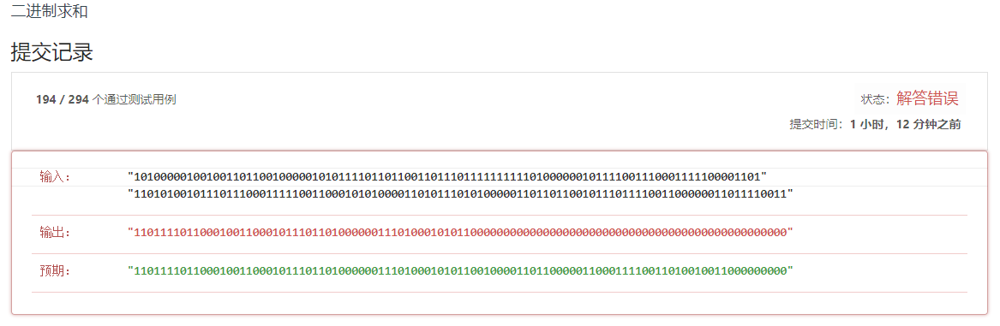

## 题目
[Leetcode-题目链接](https://leetcode-cn.com/problems/add-binary/)
[github-链接](https://github.com/WenJiang99/leetcode/tree/master/String/addBinary)


### 题目分析

看到题目描述后的第一个想法是，**先把二进制数转换成十进制，然后求和再换成二进制**，于是开始写了一个版本

```js
/**
 * @param {string} a
 * @param {string} b
 * @return {string}
 */
var addBinary = function (a, b) {
    return (toDecimal(a) + toDecimal(b)).toString(2)
};

/**
 * @param {String} str
 * @return {Number}
 */
function toDecimal(str) {
    const bytes = str.trim().split('');
    const target = bytes.reduce((sum, item, index) => {
        if (item.length < 1) return;
        return sum + Math.pow(2, bytes.length - index - 1) * Number(item)
    }, 0)
    return target;
}

```

但是提交之后却没有通过，在看到了出现错误的案例之后让我一下惊了...




老实说我确实是没有考虑到可能会有这样的输入，然后因为超出了`JavaScript`数值类型数据的范围导致了运算错误

```
"10100000100100110110010000010101111011011001101110111111111101000000101111001110001111100001101"
"110101001011101110001111100110001010100001101011101010000011011011001011101111001100000011011110011"
```


看来，直接转换成十进制运算似乎是行不通的。

于是想到把输入的两个字符串就当成字符串来处理，一个一个字符的直接按照 **二进制加法** 运算规则来计算，然后结果也存到一个字符串或者数组中，这样就可以避免输入的数值超出数据范围的问题了。

## 解法1 模拟二进制运算

### 思路

如上所说，应该按照字符串或者数组来对输入进行处理，**从最低位开始往最高位 按位相加求和，得到个位和进位**,个位直接就是输出的结果中对应位置的字符，而进位直接传到下一次进行运算，最后把数组转换成字符串返回

### 代码实现

```js
/**
 * @param {string} a
 * @param {string} b
 * @return {string}
 */
var addBinary = function (a, b) {
    let [long, short] = a.length > b.length
        ? [a.split('').reverse(), b.split('').reverse()]
        : [b.split('').reverse(), a.split('').reverse()];
    let extra = 0;
    let target = []
    let unit;
    for (let i = 0; i < long.length; i++) {
        [unit, extra] = byteSum(long[i], i >= short.length ? 0 : short[i], extra)
        target.unshift(unit)
    }
    extra != 0 && target.unshift(extra);
    return target.join('')
};

/**
 * 二进制加法运算
 * @param {String} bit1 一个二进制位， 0 || 1
 * @param {String} bit2 二进制位
 * @param {Number | String} extra 上一次相加的进位
 * @return {[Number,Number]} [unit,extra] : unit 是相加后的个位，extra 是进位
*/
function byteSum(bit1, bit2, extra) {
    const sum = Number(bit1) + Number(bit2) + Number(extra);
    return [sum % 2, sum >= 2 ? 1 : 0]
}
```

```js
let [long, short] = a.length > b.length
    ? [a.split('').reverse(), b.split('').reverse()]
    : [b.split('').reverse(), a.split('').reverse()];
```
这段代码是用来得到输入字符串 `a,b`中的较长、较短的字符串，然后转换成数组并将数组反转，反转是为了从低位开始处理（也可以直接不反转，但是也得从低位开始计算）

```js
let extra = 0;
let target = []
let unit;
for (let i = 0; i < long.length; i++) {
    [unit, extra] = byteSum(long[i], i >= short.length ? 0 : short[i], extra)
    target.unshift(unit)
}
```

上面代码是遍历两个字符串，然后按位相加得到二进制结果的个位和进位，个位直接存入到数组最开头（高位）

```js
extra != 0 && target.unshift(extra);
```
上面代码是用来判断最高位运算后是否也有进位的

最后把数组转换成字符串返回得到结果

### 效率

耗时： 76ms 63.04%
内存： 36.5MB 11.11%

## 解法2 

### 思路

上面的第一中解法写得有一些臃肿，后来仔细想一下，其实在把字符串转换成数组后，不需要反转了，直接调用 `pop`就可以， `pop`方法会弹出最后一个元素并返回，因此只需要判断 a 和 b 的长度是否减到0就可以知道数组是否空了

同时，上面采用一个数组来存运算结果的每一个位，也可以替换成用一个字符串。

### 代码

```js
/**
 * @param {string} a
 * @param {string} b
 * @return {string}
 */
var addBinary = function (a, b) {
    let extra = 0, target = '';
    let sum = 0;
    a = a.trim().split('');
    b = b.trim().split('');
    while (a.length || b.length) {
        sum = parseInt(a.pop() || 0) + parseInt(b.pop() || 0) + extra;
        target = sum % 2 + target;
        extra = sum > 1 ? 1 : 0;
    }
    return (extra != 0 ? extra : '') + target;
};
```

### 效率
耗时： 64ms 95.46%;
内存： 35.5MB 11.11%；

## 解法3 `BigInt`

### 思路

上面两个方法内存消耗都是比较大，但是我也没想到还有啥方法可以优化，然后翻了一下别人提交的记录内存消耗最小的解法  
emmmmmm，和我最开始的提交没有通过的版本思路基本是一样，但是做了数据超出范围时候的处理

**我好像也还是第一次知道JavaScript里面有`BigInt`这个东西的，只知道Java里有这种**

好了，涨知识了，看来还是基本功不牢哇...


### 代码
```js
/**
 * @param {string} a
 * @param {string} b
 * @return {string}
 */
var addBinary = function (a, b) {
    let numA
    let numB
    if (a.length >= 53 || b.length >= 53) {
        numA = BigInt("0b" + a)
        numB = BigInt("0b" + b)
    } else {
        numA = parseInt(a, 2)
        numB = parseInt(b, 2)
    }
    return (numA + numB).toString(2)
};
```

## 参考

- [MDN-BigInt] (https://developer.mozilla.org/en-US/docs/Web/JavaScript/Reference/Global_Objects/BigInt/BigInt)
- [MDN-parseInt](https://developer.mozilla.org/en-US/docs/Web/JavaScript/Reference/Global_Objects/parseInt)