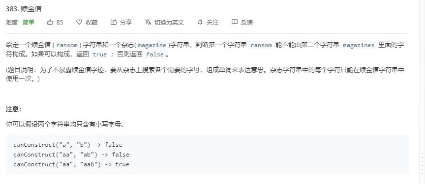

## 题目

[Leetcode-题目链接](https://leetcode-cn.com/problems/ransom-note/submissions/)   

[github-链接](https://github.com/WenJiang99/leetcode/tree/master/String/canConstruct)

   
<!-- <--! select a type of post img ref --> -->
<!--     -->


## 解法

### 思路

逐个遍历 “赎金信” `ransomNote` 中的字符，看在杂志字符串 `magazine`中是否存在，存在则在杂志字符串中删除此字符（删除一个），不存在则直接 `return false;`

### 代码
```js 
/**
 * @param {string} ransomNote
 * @param {string} magazine
 * @return {boolean}
 */
var canConstruct = function (ransomNote, magazine) {
    if (ransomNote.length > magazine.length) return false;
    let i = 0;
    while (i < ransomNote.length) {
        if (magazine.indexOf(ransomNote[i]) == -1) return false;
        magazine = magazine.replace(ransomNote[i++], ''); // 这里replace 不能加 `g`标志
    }
    return true;
};

```

### 效率
耗时：84ms, 81.98%
内存：40.7MB


