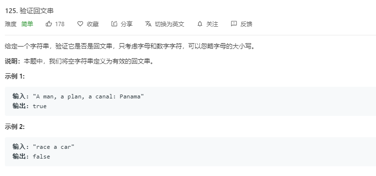

## 题目

[Leetcode-题目链接](https://leetcode-cn.com/problems/valid-palindrome/)   

[github-链接](https://github.com/WenJiang99/leetcode/tree/master/String/isPalindrome)

   
<!--     -->


## 解法1 数组反转

### 思路

因为只需要考虑数字、字母，并且不需要考虑大小写，因此需要先对字符串中的字符进行处理，去掉除了数字和字母外的字符,同时，字符串应该统一成大写或者统一小写

然后只需要比较一下字符串反转后和原来字符串是否相等就可以知道是否是回文串了

### 代码
```js 
/**
 * @param {string} s
 * @return {boolean}
 */
var isPalindrome = function (s) {
    let chars = s.replace(/[^0-9a-zA-Z]/ig, '').toLowerCase()
    return chars.split('').reverse().join('') === chars;
};

```

### 效率
耗时：80ms,80.28%
内存：38MB,23.08%

## 解法2 双向“指针”

### 思路

同样的，先对字符做一些格式处理，然后定义两个索引`head` , `root`分别指向字符串的开头和结尾，比较两个索引位置的字符是否相同

### 代码
```js 
/**
 * @param {string} s
 * @return {boolean}
 */

var isPalindrome = function(s) {
    s = s.replace(/[^\da-z]/gi,'').toUpperCase();
    let head = 0,
        root = s.length - 1;
    if ( head >= root)
        return true;
    while ( head < root ){
        if( s[head] !== s[root]){         
            return false;
        }
        head ++;
        root --;
    }
    return true;
};

```

