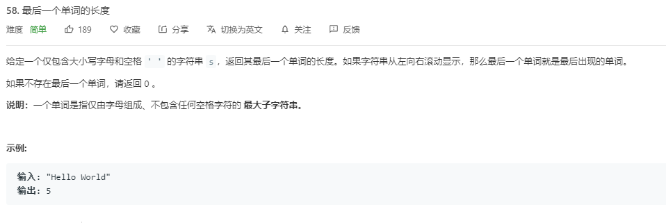

## 题目
[Leetcode-题目链接](https://leetcode-cn.com/problems/length-of-last-word/)
[github-链接](https://github.com/WenJiang99/leetcode/tree/master/String/lengthOfLastWord)

   


## 解法1 

### 思路

emmm 这是写了这么多题的最简单的一道题了 ... ，思路很简单，既然说了是只包含 **大小写字母和空格** ，那直接就可以调用 `String.prototype.split` 方法，以空格作为分隔符号来把每个单词分隔开，然后 `pop`得到最后一个单词，返回其长度即可。

这里要注意一点的是应该要对字符串先进行 `trim` 去除收尾空格，否则如果字符串结尾是个空格符的话，`pop`出来的就是空字符串

### 代码

```js
/**
 * @param {string} s
 * @return {number}
 */
var lengthOfLastWord = function(s) {
    return s.trim().split(' ').pop().length
};
```

### 效率

耗时：56ms 93.94%
内存： 33.7MB 70%