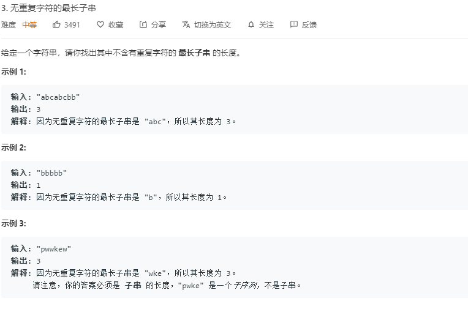

## 题目

[Leetcode-题目链接](https://leetcode-cn.com/problems/longest-substring-without-repeating-characters/)   

[github-链接](https://github.com/WenJiang99/leetcode/tree/master/String/longestSubstring)

   
<!-- select a type of hexo pic ref -->
<!--     -->


## 解法1

### 思路

题目要的是 **无重复**字符的**最长**的字串，因此需要两个变量`currentStr`和`len`分别去存储当前字串和当前的最长的无重复字符的字串长度。

对字符串进行遍历，如果当前当前字符不在 `currentStr`中，则存到 `currentStr`中，如果当前字串`currentStr`中已经有了这个字符，即当前字符是重复的，

则此时应该重新计算字串，同时对比已经存储的最长字串的长度 `len` 和当前字串的长度的大小，取大的值作为 `len`的值。

然后当前字串 `currentStr` 应该从重复的字符开始截断，再拼接上当前字符。

还有一个小地方就是，**无重复字符的最长字串的长度一定会小于等于字符串的无重复字符个数**

### 代码
```js 
/**
 * @param {string} s
 * @return {number}
 */
var lengthOfLongestSubstring = function (s) {
    if (!s) return 0;
    let currentStr = '';
    let len = 0;
    let i = 0;
    let chars = s.split('')
    const maxLen = [...new Set(chars)].length;
    while (i < chars.length && len < maxLen) {
        if (currentStr.includes(chars[i])) {
            len = Math.max(len, currentStr.length);
            currentStr = currentStr.slice(currentStr.indexOf(chars[i]) + 1) + chars[i];
        } else {
            currentStr += chars[i];
        }
        i++;
    }
    return Math.max(len, currentStr.length);
};

```
应该要注意的地方是在当前字符存在于当前字串时候，对当前字串的切分应该是从 `indexOf(chars[i]) +1`而不是 `indexOf(chars[i])`，否则重复的字符就不能被切掉

```js
currentStr = currentStr.slice(currentStr.indexOf(chars[i]) + 1) + chars[i];
```


### 效率
耗时：88ms,93.75%
内存：37.7MB, 76.71%


## 解法2

### 思路

和上面的解法大致相同，只是把字符串转换成数组进行操作

### 代码
```js 
/**
 * @param {string} s
 * @return {number}
 */
var lengthOfLongestSubstring = function (s) {
    if (!s) return 0;
    let currentStr = '';
    let len = 0;
    let i = 0;
    let chars = s.split('')
    const maxLen = [...new Set(chars)].length;
    while (chars.length && len < maxLen) {
        const item = chars.pop();
        if (currentStr.includes(item)) {
            len = Math.max(len, currentStr.length);
            currentStr = currentStr.slice(currentStr.indexOf(item) + 1) + item;
        } else currentStr = currentStr + item;
    }
    return Math.max(len, currentStr.length);
};

```

### 效率
耗时：88ms,93.75 %
内存：37.7MB,76.71 %

