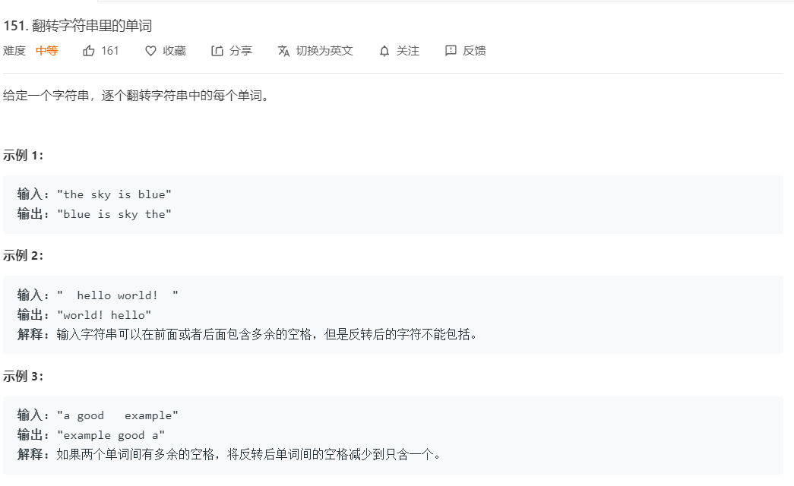

## 题目
[Leetcode-题目链接](https://leetcode-cn.com/problems/reverse-words-in-a-string/submissions/)
[github-链接](https://github.com/WenJiang99/leetcode/tree/master/String/reverseWords)




## 解法1

### 思路

这个题目也不是很难，起码思路还是很容易就可以想到了的。

题目要求只是把字符串中的单词的顺序反转过来，而不需要把单词中的每一个字母也反转，所以只需要先把字符串的每一个单词都拆分出来得到一个数组，然后调用数组的 `reverse`方法把数组反转一下，然后在重新变成一个字符串就OK了

这里需要注意的一个坑是，原来的字符串中一个单词可能有很多个空格字符分隔，但是反转后的单词都只能用一个空格分隔，所以需要做一下处理。

### 代码

```js
/**
 * @param {string} s
 * @return {string}
 */
var reverseWords = function (s) {
    return s.trim().split(' ').reverse().filter(item => !!item).join(' ')
};
```

`s.trim()` 用来先对字符串首尾的空格做一下处理，然后调用 `split`方法用空格作为分隔符把字符串拆开得到一个单词数组， `reverse` 方法用来反转数组， `filter`方法用来把数组里的空字符去掉

### 效率

耗时：60ms 92.22$
内存： 34.6MB 100%

