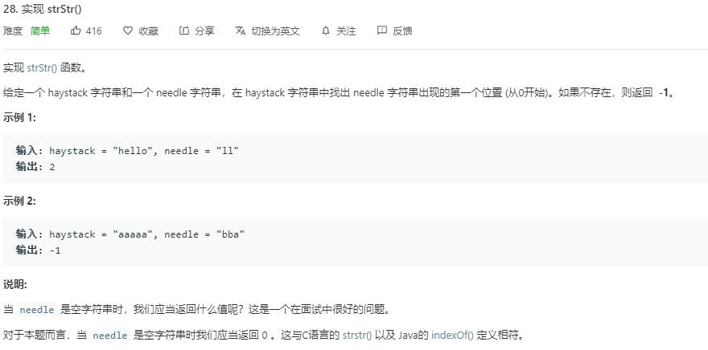

## 题目

[Leetcode-题目链接](https://leetcode-cn.com/problems/implement-strstr/)




## 作弊解法 ES6 String.prototype.indexOf
```js
/**
 * @param {string} haystack
 * @param {string} needle
 * @return {number}
 */
var strStr = function (haystack, needle) {
    return haystack.indexOf(needle)
};

```

### # 效率
耗时：74ms
内存：33.5MB , 非常意外的超过了 `100%` 的 `JS`记录，哈哈哈哈哈笑死了

### # 思路
这还有啥好说的啊... 看 [官方文档](https://developer.mozilla.org/en-US/docs/Web/JavaScript/Reference/Global_Objects/String/indexOf) 就好了

## 解法2 双重for循环实现indexOf

```js
/**
 * @param {string} haystack
 * @param {string} needle
 * @return {number}
 */
var strStr = function (haystack, needle) {
    return indexOf(haystack, needle)

};
/**
 * @param {string} haystack
 * @param {string} needle
 * @return {number}
 */
function indexOf(src, subStr) {
    if (!subStr) return 0;
    if (!src) return -1;
    for (let i = 0; i <= src.length - subStr.length; i++) {
        if (src[i] === subStr[0]) { 
            let found = true;
            for (let j = 1; j < subStr.length; j++) {
                if (src[i + j] !== subStr[j]) {
                    found = false;
                    break;
                }
            }
            if (found) return i;
        }
    }
    return -1;
}
```
### # 效率

耗时：`64ms` 65%
内存：`34.9MB`  62.47%

### # 思路

```js
for (let i = 0; i <= src.length - subStr.length; i++) {
    if (src[i] === subStr[0]) { 
        // ...
    }
}
```

第一层的for循环是用来找出源字符串`src`和字串`subStr`相同的首字符的索引` i `的，找出后再去看源字符串中 ` i`后面与字串相同的一段字串是否与要找的字串`subStr`相同
如果相同则说明所要找的索引就是 `i`，否则就继续往后找


## 解法3 用String.prototype.slice代替for循环

```js
/**
 * @param {string} haystack
 * @param {string} needle
 * @return {number}
 */
var strStr = function (haystack, needle) {
    return indexOf(haystack, needle)

};
/**
 * @param {string} haystack
 * @param {string} needle
 * @return {number}
 */
function indexOf(src, subStr) {
    if (!subStr) return 0;
    if (!src) return -1;
    for (let i = 0; i <= src.length - subStr.length; i++) {
        if (src[i] === subStr[0]) {
            if (subStr === src.slice(i, i + subStr.length)) return i;
        }
    }
    return -1;
}
```

### # 效率

耗时：`56ms` 95.9% 
内存：`33.8MB`  92.47%

### # 思路

```js
if (src[i] === subStr[0]) {
    if (subStr === src.slice(i, i + subStr.length)) return i;
}
```

上面的第二种解法是用了两重for循环一个一个的比较两个字符串的字符是否相等，完全用了很底层的写法，可以完全兼容，但是实际也不需要这样写。
第二层 `for循环` 是在找出 `src`和 `subStr` 相同的首字符后再看 `src`后面与 `subStr` 长度相同的一段与 `subStr` 是否相同，而这个可以使用
`slice`方法来对 `src` 切分得到指定索引区间的字串，直接把`subStr`和切分下来的整段字串进行比较就可以

### # 参考
- [String.prototype.slice]()
