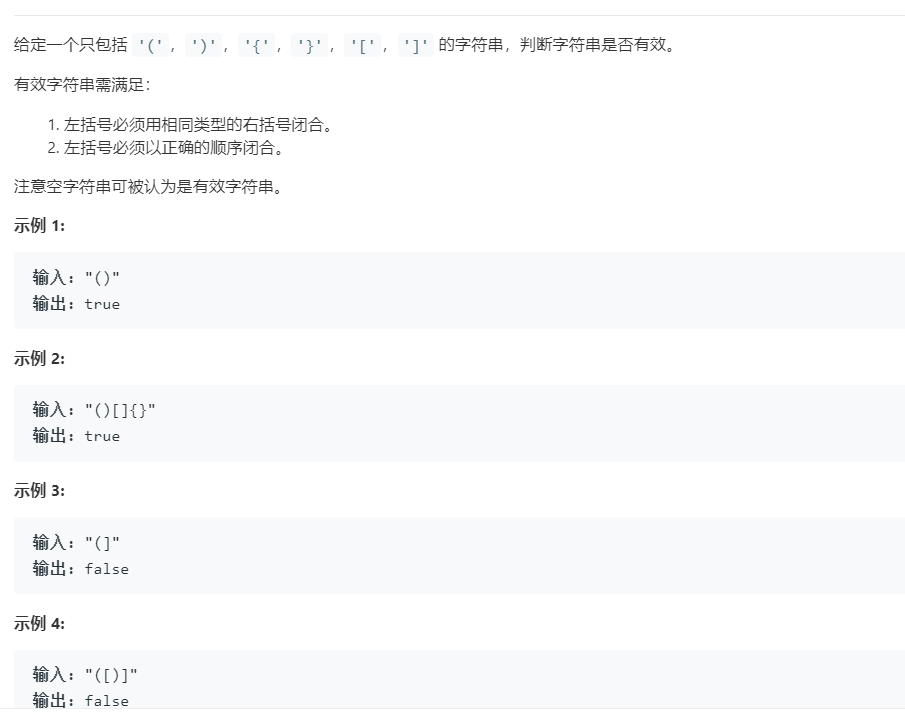

## 题目

[LeetCode-题目链接](https://leetcode-cn.com/problems/valid-parentheses/)




## 解法1 数组模拟堆栈 64ms 33.7MB

```js
/**
 * @param {string} s
 * @return {boolean}
 */
var isValid = function (s) {
    const stack = []
    for (let i = 0; i < s.length; i++) {
        switch (s[i]) {
            case ')': {
                if (stack.pop() !== '(') return false;
                break;
            };
            case ']': {
                if (stack.pop() !== '[') return false;
                break;
            }
            case '}': {
                if (stack.pop() !== '{') return false;
                break;
            };
            default: stack.push(s[i])
        }
    }
    return stack.length === 0;
};
```

## 解法2

```js
/**
 * @param {string} s
 * @return {boolean}
 */
var isValid = function (s) {
    const bracketMap = { ')': '(', ']': '[', '}': '{' }
    const stack = []
    for (let i = 0; i < s.length; i++) {
        if (s[i] in bracketMap) {
            if (stack.pop() !== bracketMap[s[i]]) return false;
        } else stack.push(s[i]);
    }
    return stack.length === 0;
};

```

### # 思路

解法2的思路其实和解法1几乎完全一致，就是用一个`Object`来代替了 `switch case` ，解法2的写法比解法1要优雅一些，但是执行效率比解法1要低一些。
**果然还是鱼和熊掌不可兼得，唯独丑和单身可以啊**